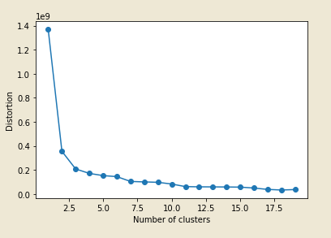
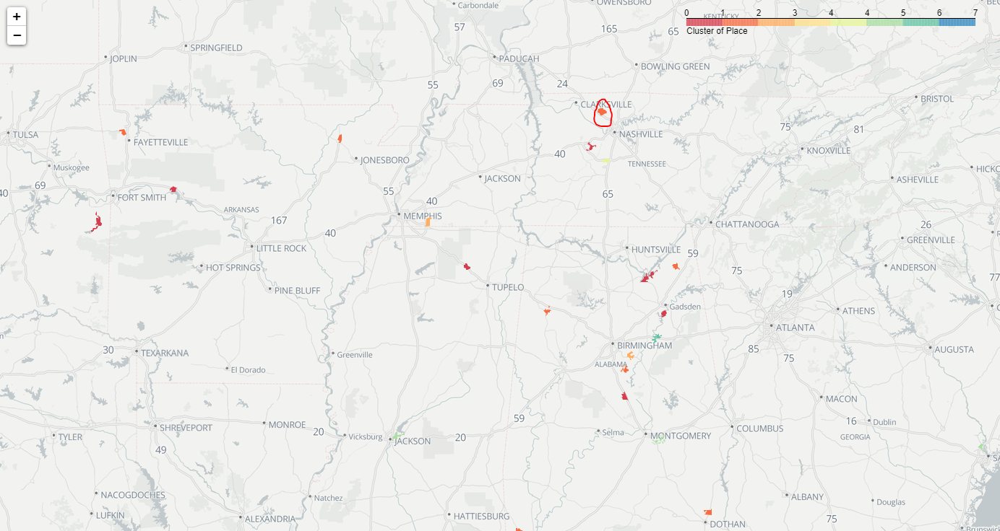
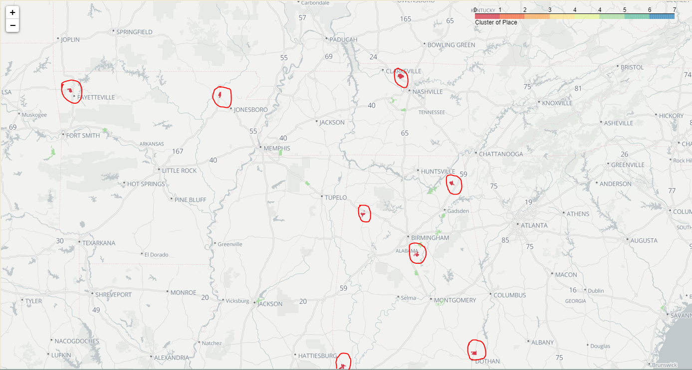
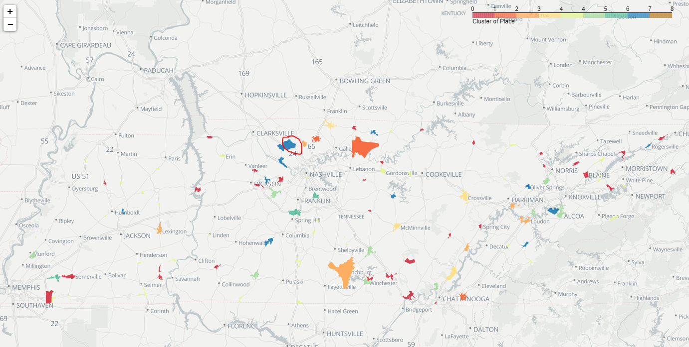
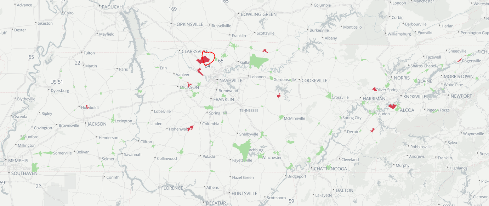

# **Coopertown-Tennessee Peer Communities**

## *Table of Contents*  
+ Overview
+ Data Prep  
+ Analysis  
+ Results  

## Overview  

The Greater Nashville Regional Council provides urban planning support to may rural areas in the Middle Tennessee region. This includes Coopertown town in Robertson County, Tennessee. This repository walks through a process of finding peer communities for Coopertown using K-Means clustering of multiple data inputs. These communities will be used for comparison of fee structures; the goal is to find communities that are similar to Coopertown in terms of size, growth, and other factors, to see how they are handling their own growth and ultimately to develop optimal structure locally. Previously, peer communities were selected simply by finding familiar, neighboring towns that may not actually be that similar to Coopertown. This approach vastly expands the search. This analysis is conducted twice, once for all places in the US and once for only places in the State of Tennessee. The analysis of all places is conducted out of curiousity and potential future use, but the analysis of Tennessee places is the one that is used for comparing fee structures as these are partly determined by state legislation.  

## Data Prep  

The following data is obtained at the place level using the Census API from the American Community Survey 5-Year Estimates:

+ B01003_001E: Total Population, 2005-2009, 2010-2014, 2015-2019  
+ B25010_001E: Average Household Size, 2015-2019  
+ B08301_001E: Total Commuters, 2015-2019  
+ S0801_C01_046E: Average Commute Time to Work, 2015-2019, **from subject table**

These data were used to compute real and percent change in population over both a ten and fifteen year period up to the most current 5-Year estimate (short term and long term), average household size and time spent commuting was left as is, while both are intended to help indicate whether a community is more rural or urban or what is called a "bedroom" community.

This data was joined with matching GEOIDs (here a combination of State and Place FIPS codes) with place level Census TIGER geographic files that provide information about the total land and water area of a place as well as numerous Census and legal classifications. Most of this data was dropped as this project only necessitates area and geometry fields for calculating population density and mapping. After unit conversion between square meters to square miles, this data was used to compute population densities for the three 5-Year periods in question, and then real and percent change in population density over both the short and long-term.

Additionally, data on annual residential permits by place was collected from the Economic Census' Building Permits dataset. More information on this data can be found <a href="https://www.census.gov/construction/bps/">here</a>. These text files are read in using the `requests` package, decoded in case of any Unicode characters, and formatted as a dataframe. Leading and trailing spaces are removed from a GEOID field created from the State and Place FIPS codes, and all permit types (1-5+ units) are added up before merging with the rest of the prepped data.

Finally, the assumption was made that any community with a value of zero or NA for population during any of the three time periods could be thrown out. These would not be the kinds of communities that we could give a relevant comparison. In addition to this, CDPs, villages, and boroughs were also dropped as these places either never or extremely rarely make their own fee system or have local governments (they are instead often a part of a County jurisdiction).

Find duplicates of this process both for all places and for the State of Tennessee under `notebooks`.

## Analysis  

**Pre-Clustering**

First, logical parameters are set at the same time that extreme outliers are removed. Cluster analysis performs best when extreme outliers are removed so that the process can identify nuanced differences in a more similar group of data. This can be though of as creating a group via enforcing variable parameters in which we would be interested in seeing peers instead of using the algorithm to create said group. In order to be relevant, Coopertown's cluster would need to be identified out of a group of communities that are somewhat similar to Coopertown already so that the algorithm can find the closest peers within that group. The following parameters are enforced:  

+ hhsize - cut out any less than 1 (pure nonsensical outliers)
+ population - cut out any less than 1,000 or more than 10,000  
+ population change - cut out any with no growth  
+ square mileage - cut out any with less than 5 or more than 100 square miles  

This was for all places, for all Tennessee places the same parameters were enforced *except* the square mileage. For all places, this took the sample from 10,692 places to 90 places. For Tennessee places, this took the sample from 280 to 105 places.

**K-Means Clustering**

K Means Clustering is an unsupervised machine learning process that groups similar data points together so that the user can discover underlying patterns. The user defines a target number `k` of centroids representing the center of each cluster, and then each data point is allocated to whichever cluster it fits with best based on the reduction of the sum of squared distances from the centroid. This post on the Towards Data Science Blog explains what the algorithm does well, find it <a href="https://towardsdatascience.com/understanding-k-means-clustering-in-machine-learning-6a6e67336aa1">here</a>.

Taken from this post: "To process the learning data, the K-means algorithm in data mining starts with a first group of randomly selected centroids, which are used as the beginning points for every cluster, and then performs iterative (repetitive) calculations to optimize the positions of the centroids
It halts creating and optimizing clusters when either:

+ The centroids have stabilized — there is no change in their values because the clustering has been successful.
+ The defined number of iterations has been achieved."  

In order to determine the number of centroids and clusters for the place data, the elbow method was implemented. This is a way of visualizing the levels of distortion that occur for different scenarios for number of centroids. The distortion levels represent the within-cluster sum of squares. The plot for all Tennessee places can be seen below, where the number of clusters optimal for minimizing distortion is identified as 8.

Scikit learn's `KMeans` method is used to process the data. Their `fit_predict` method is then implemented to compute cluster centers and predict the cluster index (which cluster the datapoints lie in) for each sample. This index is then assigned as a new column to the initial dataframe. Finally, Coopertown's cluster is identified and peer communities can be examined.

## Results  

In the State of Tennessee, eleven peer communities are identified.

+ Madisonville: Monroe County, '15-'19 population `4,920`, `7.89%` long-term growth     
+ Louisville: Blount County, '15-'19 population `4,133`, `94.59%` long-term growth   
+ Ashland City: Cheatham County, '15-'19 population `4,680`, `3.15%` long-term growth     
+ White Bluff: Dickson County, '15-'19 population `3,517`, `43.43%` long-term growth   
+ Pleasant View: Cheatham County, '15-'19 population `4,480`, `16.79%` long-term growth    
+ Rogersville: Hawkins County, '15-'19 population `4,437`, `3.40%` long-term growth   
+ Medina: Gibson County, '15-'19 population `4,209`, `80.18%` long-term growth   
+ Mount Pleasant: Maury County, '15-'19 population `4,847`, `8.90%` long-term growth   
+ Oliver Springs: Anderson, Morgan, and Roane Counties, '15-'19 population `4,468`, `39.06%` long-term growth   
+ Lafayette: Macon County, '15-'19 population `5,171`, `19.31%` long-term growth   
+ Smithville: DeKalb County, '15-'19 population `4,711`, `9.46%` long-term growth  

The long term growth varies, as many of these communities had a much lower population in the years between 2005 and 2009, but have grown to be of similar size to Coopertown.

In the entire US, twenty peer communities are identified.  
+ Rainsville, Alabama:  '15-'19 population `5,041`, `2.92` long-term growth  
+ Columbiana, Alabama: '15-'19 population `4,481`, `15.13` long-term growth  
+ Headland, Alabama: '15-'19 population `4.665`, `17.80` long-term growth  
+ Winfield, Alabama:  '15-'19 population `4,539`, `2.74` long-term growth
+ Citronelle, Alabama:  '15-'19 population `3,893`, `4.59` long-term growth  
+ Kotzebue, Alaska:  '15-'19 population `3,287`, `4.28` long-term growth  
+ Dewey-Humboldt, Arizona:  '15-'19 population `4,063`, `8.87` long-term growth  
+ Parker, Arizona:  '15-'19 population `3,132`, `0.16` long-term growth  
+ Quartzsite, Arizona:  '15-'19 population `3,714`, `7.78` long-term growth  
+ Taylor, Arizona:  '15-'19 population `4,202`, `4.27%` long-term growth  
+ Walnut Ridge, Arkansas:  '15-'19 population `5,098`, `8.26%` long-term growth  
+ Tontitown, Arkansas:  '15-'19 population `3,677`, `52.13%` long-term growth  
+ Independence, Minnesota:  '15-'19 population `3,776`, `5.83%` long-term growth  
+ Nowthen, Minnesota:  '15-'19 population `4,682`, `8.33%` long-term growth  
+ Scandia, Minnesota:  '15-'19 population `4,112`, `19.95%` long-term growth  
+ St. Augusta, Minnesota:  '15-'19 population `3,720`, `14.64%` long-term growth  
+ Columbus, Minnesota:  '15-'19 population `4,055`, `0.87%` long-term growth  
+ Slaughterville, Oklahoma:  '15-'19 population `4,239`, `6.29%` long-term growth  
+ Bethel Acres, Oklahoma:  '15-'19 population `3,147`, `10.19%` long-term growth  
+ McGregor, Texas:  '15-'19 population `5,144`, `5.93%` long-term growth  

These also have some variation in long term growth. With an opportunity for further analysis it would be interesting to see if the states where these peers seem to be clustered; Alabama, Arizona, Minnessota, for example, would appear in the same cluster as each other if this was run at a state level given the same input variables.

**Please see the mapping notebooks to see code for visualizations of where these communities are located created with Folium.**

Find screenshots of these Folium maps below. Then, find links where you are able to interact with the maps here:

+ <a target="_blank" rel="noopener noreferrer" href="https://nbviewer.org/github/Greater-Nashville-Regional-Council/Regional-Planning/blob/main/2.%20Coopertown%20Peer%20Communities/notebooks/5.%20Mapping%20All%20Places%2C%20Points.ipynb">All Places, Points</a>.
+ <a target="_blank" rel="noopener noreferrer" href="https://nbviewer.org/github/Greater-Nashville-Regional-Council/Regional-Planning/blob/main/2.%20Coopertown%20Peer%20Communities/notebooks/5.%20Mapping%20All%20Places.ipynb">All Places, Polygons</a>.  
+ <a target="_blank" rel="noopener noreferrer" href="https://nbviewer.org/github/Greater-Nashville-Regional-Council/Regional-Planning/blob/main/2.%20Coopertown%20Peer%20Communities/notebooks/6.%20Mapping%20Tennessee%20Places.ipynb" target = "blank">All Tennessee Places</a>.

First, beginning with the places in all of the US that were left over after parameters were enforced, the clusters emerging from the K-Means algorithm in the Southeast US are below. Given the large scale it's difficult to see the colors when examining the entire map.

Then, the Coopertown cluster is in red while the rest of the sample is in green for the same region.

Next, all Tennessee places in the sample visualized by cluster (Pleasant View city shares a border with Coopertown).

Finally, all Tennessee places where Coopertown's cluster is red and all other sample places are green.

